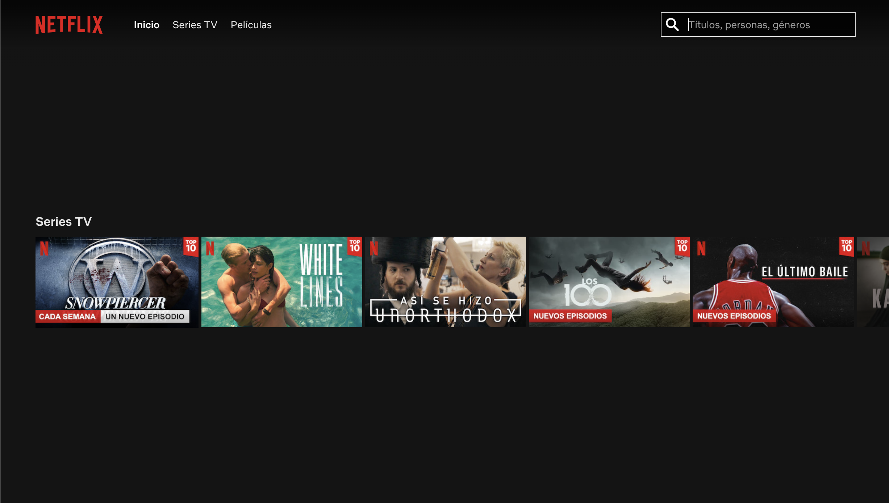
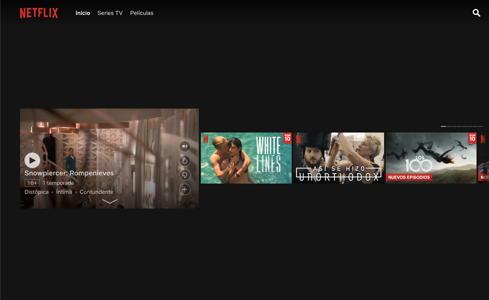

# Angular Sesión 7 - Ejercicios

Vamos a hacer nuestro propio catálogo de Netflix!

Vas a ver como juntando lo que hemos ido aprendiendo:

- Peticiones a APIS
- Enrutamiento
- Lazy Loading
- Pipes para formateo de string
- Pipes para filtrado

Eres capaz de crear tu propio catálogo de películas:

Cuando acabes tu web debería lucir así:



Para pintar el listado de series / película en cada sección ponemos a tu disposición las siguientes peticiones:

INICIO: [https://jsonblob.com/api/91467cb4-9f7f-11ea-bb3c-c1622b158f72](https://jsonblob.com/api/91467cb4-9f7f-11ea-bb3c-c1622b158f72)

SERIES TV: [https://jsonblob.com/api/25672c0d-9f80-11ea-bb3c-b7fd8bc47ca0](https://jsonblob.com/api/25672c0d-9f80-11ea-bb3c-b7fd8bc47ca0)

PELICULAS: [https://jsonblob.com/api/b9f20e24-9f80-11ea-bb3c-135f3a58d8ed](https://jsonblob.com/api/b9f20e24-9f80-11ea-bb3c-135f3a58d8ed)

Realiza una web que tenga 3 rutas diferentes para mostrar cada uno de los listados, cargando siempre haciendo uso de Lazy Loading. Desde cada pagina se hará la petición a un servicio de Angular que devolverá el listado de películas / series para pintarlos en la vista.

Recuerda que debes marcar en qué página se encuentra el usuario en el menú.

Una serie o película se muestra siempre igual, así que aprovecha para hacer un componente CatalogItem para poder mostrar los detalles de una forma más cómoda.

### **BONUS**

Al hacer click en un item de catálogo este debera mostrar su información de la forma que puedes ver en la siguiente imagen:



Si te has fijado el buscador está ahora cerrado, haz que se abra solo al hacer click en él.

### POR SI ACASO...

Por si tienes algún problema con las APIS, y a modo de referencia te dejamos los objetos que deberían devolverte las peticiones GET

Inicio:

```json
[{
    "title": "Snowpiercer: Rompenives",
    "imageUrl": "https://pics.filmaffinity.com/Snowpiercer_Rompenieves_Serie_de_TV-134998892-large.jpg",
    "tags": ["Distópica", "Íntima", "Contundente"],
    "numSeasons": 1
},{
    "title": "White Lines",
    "imageUrl": "https://pics.filmaffinity.com/White_Lines_Serie_de_TV-192485614-large.jpg",
    "tags": ["Peculiar", "Suspense", "Drama"],
    "numSeasons": 1
},{
    "title": "Unorthodox",
    "imageUrl": "https://pics.filmaffinity.com/Unorthodox_Miniserie_de_TV-933502693-large.jpg",
    "tags": ["Docuserie", "Religión", "Alemana"],
    "numSeasons": 1
},{
    "title": "El último baile",
    "imageUrl": "https://pics.filmaffinity.com/El_ltimo_baile_Miniserie_de_TV-389158062-large.jpg",
    "tags": ["Fascinante", "Docuserie", "Deporte"],
    "numSeasons": 1
}]
```

Series TV:

```json
[{
    "title": "Modern Family",
    "imageUrl": "https://pics.filmaffinity.com/Modern_Family_Serie_de_TV-197865073-large.jpg",
    "tags": ["Conmovdora", "Íntima", "Falso Documental"],
    "numSeasons": 10
},{
    "title": "Homeland",
    "imageUrl": "https://pics.filmaffinity.com/Homeland_Serie_de_TV-391047773-large.jpg",
    "tags": ["De suspense", "Misterio", "A fuego lento"],
    "numSeasons": 7
},{
    "title": "La casa de papel",
    "imageUrl": "https://pics.filmaffinity.com/La_casa_de_papel_Serie_de_TV-169273913-large.jpg",
    "tags": ["Española", "Suspense", "Atracos"],
    "numSeasons": 3
},{
    "title": "The Sinner",
    "imageUrl": "https://pics.filmaffinity.com/The_Sinner_Miniserie_de_TV-296231478-large.jpg",
    "tags": ["Policiaca", "Investigación", "Asesinatos"],
    "numSeasons": 3
}]
```

Películas: 

```json
[{
    "title": "8 Millas",
    "imageUrl": "https://pics.filmaffinity.com/8_millas-229373133-large.jpg",
    "tags": ["Impactante", "Descarnada", "Hip-Hop"],
    "numSeasons": 1
},{
    "title": "Harry Potter",
    "imageUrl": "https://pics.filmaffinity.com/Harry_Potter_y_la_piedra_filosofal-192221009-large.jpg",
    "tags": ["Magia", "Fantasia", "Familiar"],
    "numSeasons": 1
},{
    "title": "El señor de los anillos",
    "imageUrl": "https://pics.filmaffinity.com/El_se_or_de_los_anillos_La_comunidad_del_anillo-744631610-large.jpg",
    "tags": ["Siniestra", "Epopeya", "Fantástica"],
    "numSeasons": 1
},{
    "title": "El Padrino",
    "imageUrl": "https://pics.filmaffinity.com/El_padrino-590289523-large.jpg",
    "tags": ["Violenta", "Contudente", "Italiana"],
    "numSeasons": 1
}]
```